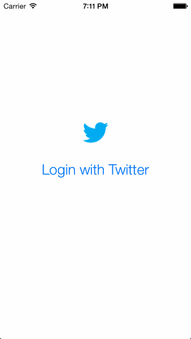

# Twitter iOS Application Redux

This is an enhanced version of the iOS iPhone Twitter Client made previously.  In addition to the timeline view, a profile view has been added that contains a profile header along with tweet, following, and follower counts.  Also added is a mentions view.  A slide out menu (hamburger menu) has been added to switch between these main views.  In the profile view, paging has been implemented to view the account description.  Scaling and parallax have been implemented within the header view on pull down and scrolling.  Tapping on a user's profile image loads the profile view for that user.  When long-pressing the title bar or pulling down the profile screen, an account screen can be brought up to switch to another account, remove stored accounts, or authenticate with a new account.

Time spent: 32 hours spent in total

Completed user stories:

Hamburger menu
* [x] Dragging anywhere in the view should reveal the menu.
* [x] The menu should include links to your profile, the home timeline, and the mentions view.
* [x] Take liberty with the menu UI.

Profile page
* [x] Contains the user header view
* [x] Contains a section with the users basic stats: # tweets, # following, # followers
* [x] Optional: Implement the paging view for the user description.
* [x] Optional: As the paging view moves, increase the opacity of the background screen.
* [x] Optional: Pulling down the profile page should blur and resize the header image.

Home Timeline
* [x] Tapping on a user image should bring up that user's profile page
* [x] Optional: Account switching
* [x] Long press on tab bar to bring up Account view with animation
* [x] Tap account to switch to
* [x] Include a plus button to Add an Account
* [x] Swipe to delete an account

Notes
* When tapping on a profile image for a user you are already viewing a profile for, a shake effect happens to indicate you are already viewing that user's profile.
* I implemented long pressing of the navbar title to bring up the accounts view since no tab bar was used for this app.
* The accounts screen can also be invoked via the slide out menu or by pulling down on the profile page similar to today's twitter app
* I don't store multiple access tokens in this version so you still need to enter your password when switching accounts.

References:

* http://courses.codepath.com/videos/ios_intro_week_4_part_1.mov
* https://about.twitter.com/press/brand-assets

Walkthrough of all user stories:

GIF created with [LiceCap](http://www.cockos.com/licecap/).

# Twitter iOS Application

This is an iOS iPhone Twitter Client that uses OAuth and the Twitter API [Twitter API](https://dev.twitter.com/overview/documentation).  The app can be used to sign into Twitter, tweet, view one's timeline, reply, retweet, and favorite a tweet.

Time spent: 21 hours spent in total

Completed user stories: 

* [x] User can sign in using OAuth login flow
* [x] User can view last 20 tweets from their home timeline
* [x] The current signed in user will be persisted across restarts
* [x] In the home timeline, user can view tweet with the user profile picture, username, tweet text, and timestamp.
* [x] User can pull to refresh
* [x] User can compose a new tweet by tapping on a compose button.
* [x] User can tap on a tweet to view it, with controls to retweet, favorite, and reply.
* [x] Optional: When composing, you should have a countdown in the upper right for the tweet limit.
* [x] Optional: After creating a new tweet, a user should be able to view it in the timeline immediately without refetching the timeline from the network.
* [x] Optional: Retweeting and favoriting should increment the retweet and favorite count.
* [x] Optional: User should be able to unretweet and unfavorite and should decrement the retweet and favorite count.
* [x] Optional: Replies should be prefixed with the username and the reply_id should be set when posting the tweet,
* [x] Optional: User can load more tweets once they reach the bottom of the feed using infinite loading similar to the actual Twitter client.

References:

* https://dev.twitter.com/overview/documentation
* https://dev.twitter.com/overview/general/image-resources

Walkthrough of all user stories:

GIF created with [LiceCap](http://www.cockos.com/licecap/).