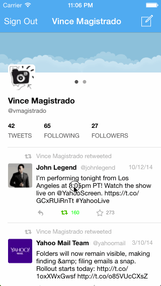

# Twitter iOS Application

This is an iOS iPhone Twitter Client that uses OAuth and the Twitter API [Twitter API](https://dev.twitter.com/overview/documentation).  The app can be used to sign into Twitter, tweet, view one's timeline, reply, retweet, and favorite a tweet.

Time spent: 21 hours spent in total

Completed user stories: 

* [x] User can sign in using OAuth login flow
* [x] User can view last 20 tweets from their home timeline
* [x] The current signed in user will be persisted across restarts
* [x] In the home timeline, user can view tweet with the user profile picture, username, tweet text, and timestamp.
* [x] User can pull to refresh
* [x] User can compose a new tweet by tapping on a compose button.
* [x] User can tap on a tweet to view it, with controls to retweet, favorite, and reply.
* [x] Optional: When composing, you should have a countdown in the upper right for the tweet limit.
* [x] Optional: After creating a new tweet, a user should be able to view it in the timeline immediately without refetching the timeline from the network.
* [x] Optional: Retweeting and favoriting should increment the retweet and favorite count.
* [x] Optional: User should be able to unretweet and unfavorite and should decrement the retweet and favorite count.
* [x] Optional: Replies should be prefixed with the username and the reply_id should be set when posting the tweet,
* [x] Optional: User can load more tweets once they reach the bottom of the feed using infinite loading similar to the actual Twitter client.

References:

* https://dev.twitter.com/overview/documentation
* https://dev.twitter.com/overview/general/image-resources

Walkthrough of all user stories:

GIF created with [LiceCap](http://www.cockos.com/licecap/).